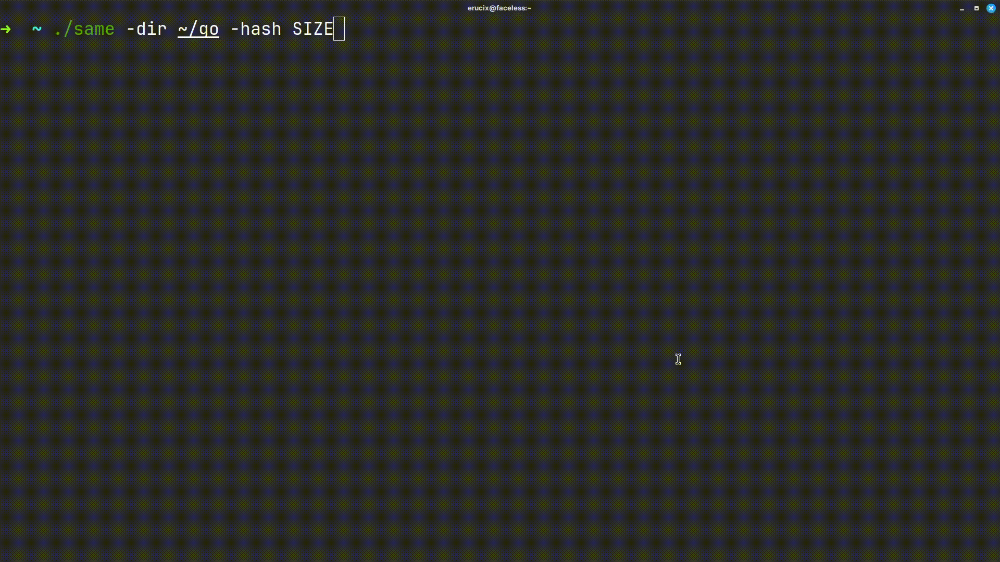

# same - File integrity checker

## Usage

```bash
git clone https://github.com/rohitaryal/same.git
cd same
go build -o same ./cmd/same
./same --help
```

## How does it look?

<p style="text-align: center">

</p>

## Help

```txt
 same: File integrity verification tool

  -check
        Initiates integrity checkup using backup file
  -dir string
        Direcory to be backed up (default ".")
  -file string
        Path to save/saved backup file
  -hash string
        Hash to use for integrity check [md5, size, sha256] (default "md5")
  -init
        Initiates hash backup for a path

Backup Example: same -init -dir /home/user/Downloads -hash md5
Checkiup Example: same -chech -file backup-1.same -hash md5
```
